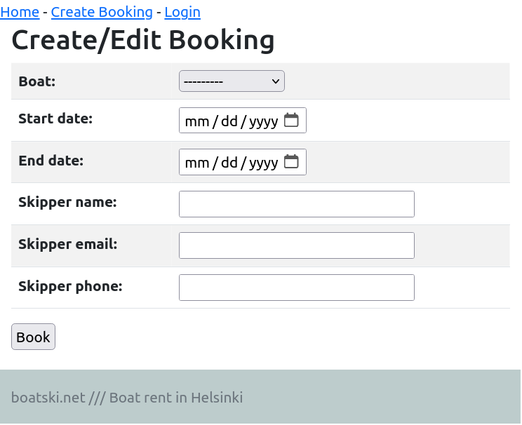
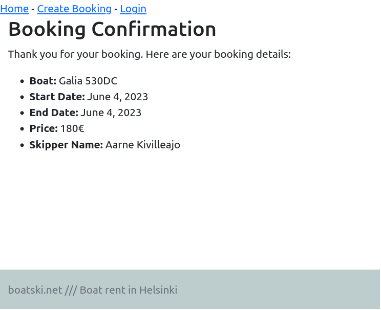
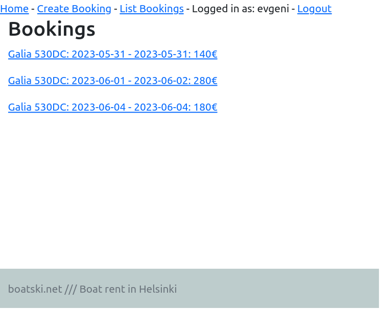
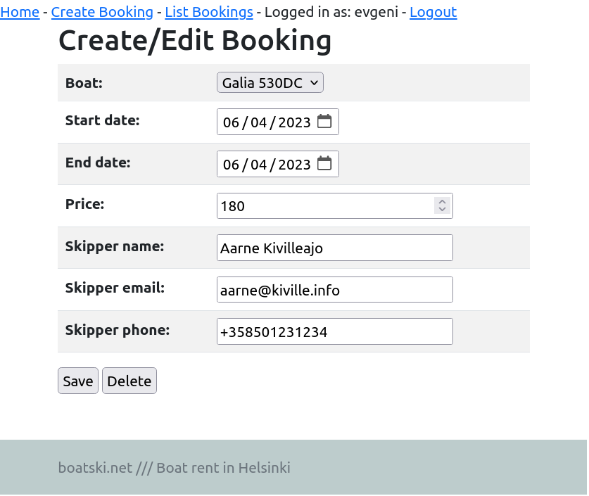
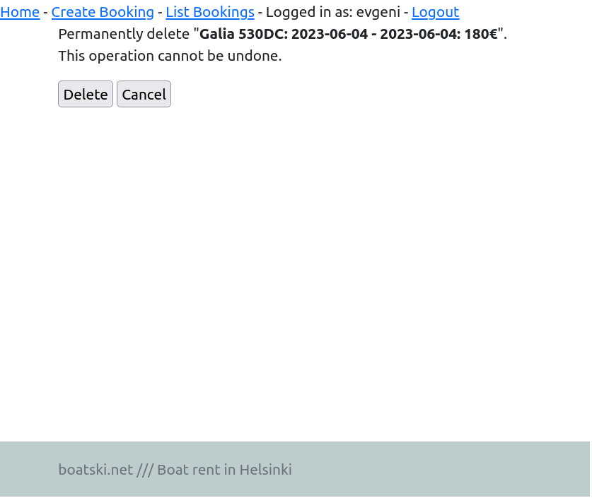
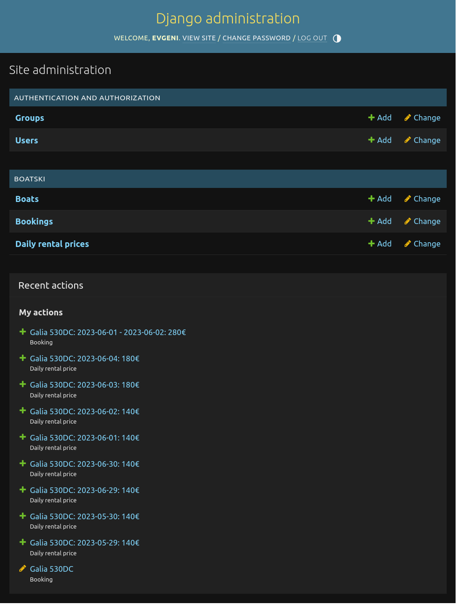

# App description

## django-boatrent v0.1 alpha

This is a simple boat rental service application that allows to rent a boat for a day or a longer period of time.

Everyone can make a booking, but only admin is able to modify and delete bookings.

# Screenshots

## Anonymous user is able to browse the website and create booking

## Booking confirmation

When new booking is created system verifies that there are no overlappings and provides a summary with calculated price.

## Logged in user is able to list bookings and modify them

Note that modify view is different compared to create new booking view, admin is able to see and modify "price" field as well. 

Admin can also modify any field in the booking and delete the booking completely.

# URL of Admin panel

Admin panel URL has been modified slightly from default.

https://yoursite.com/adm-boatski/

# TODO
This is an MVP alpha version, a lot of functionality needs to be added, such as:

- UI improvements (adding boat pictures, dock location, etc)
- Update RentalPrices from JSON
- Add checks and validations
- Notification e-mails (Mailgun)

# Run inside a virtual environment

First you need to create a new virtualenv and install django

	virtualenv --system-site-packages -p python3 env/

If you don't have a virtualenv installed, you need to install one. On Ubuntu or Debian Linux, you can do it with apt-get

	apt-get -y install virtualenv

Start your virtual env

	source env/bin/activate

To stop virtualenv

	deactivate

# References
https://terokarvinen.com/2023/django-cheatsheet/